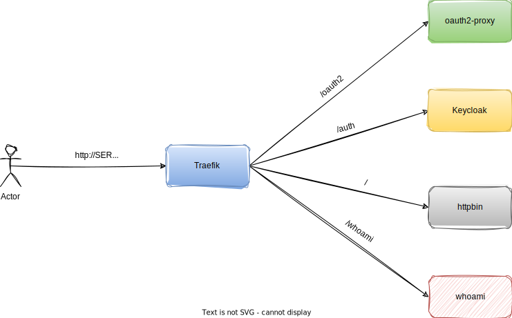

# OAuth2 Proxy with Keycloak as Provider

This repo for securing your web application with OAuth2 Proxy and Keycloak as IDP.

The architecture is look like this:

## Pre-requisites

- Docker
- Docker Compose

## How to run

1. Clone this repo
2. Run `docker-compose up -d`
3. Map the `SERVER_FQDN` domain to `/etc/hosts` or `/c/Windows/System32/drivers/etc/hosts` file
4. Open your browser and go to `http://<SERVER_FQDN>`
5. Then login with the creds `demo@arulraj.net / welcome123`

To logout

http://demo.arulraj.net/oauth2/sign_out?rd=http%3A%2F%2Fdemo.arulraj.net%2Fauth%2Frealms%2Fdemo%2Fprotocol%2Fopenid-connect%2Flogout%3Fredirect-uri%3Dhttp%3A%2F%2Fdemo.arulraj.net%2F

## TODO

- [ ] Fix logout redirect URI
- [ ] First name and last name as header
- [ ] Expose first name and last name in userinfo endpoint
- [ ] Redis for session store

## Author

  
   
  <strong>Arul</strong>
   
  
  
  

